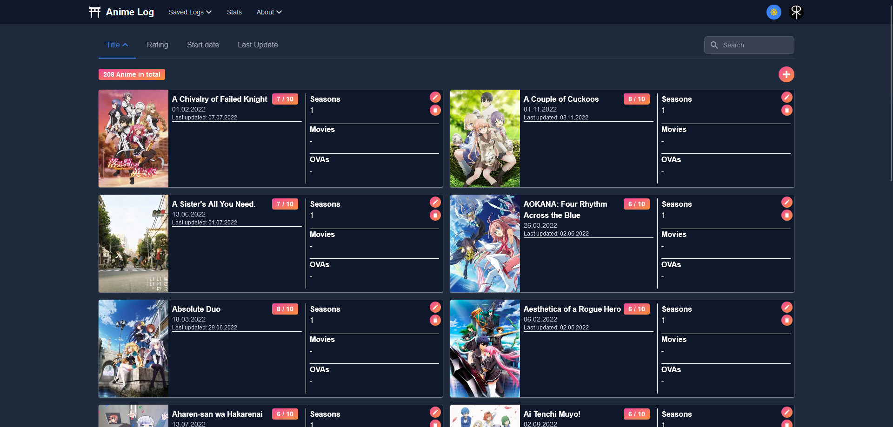
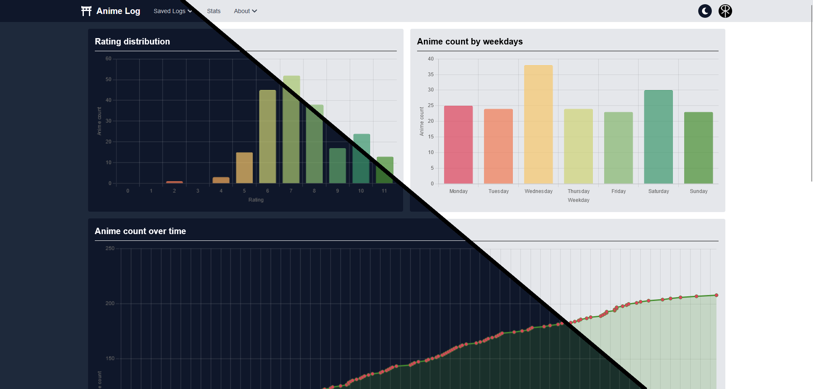

[](https://github.com/WieseChristoph/anime-log/blob/main/LICENSE)


# Anime Log

Website to log and share watched anime.

## Home



## Stats



# Configuration

## Next-Auth Data

Set environment variables:

```
NEXTAUTH_SECRET=<use [openssl rand -hex 32] to generate a 32 bytes value>
NEXTAUTH_URL=<http://YOUR_DOMAIN> (must not be set when deploying to vercel)
```

## Discord Authentication

Set environment variables:

```
DISCORD_CLIENT_ID=<YOUR_CLIENT_ID>
DISCORD_CLIENT_SECRET=<YOUR_CLIENT_SECRET>
```

## Database Connection

Set environment variable `DATABASE_URL` with an [CockroackDB](https://www.cockroachlabs.com/) database URL. Alternatively you can use a Postgres database URL, but you need to change the datasource provider in `prisma/schema.prisma` from `cockroach` to `postgresql`.

# Developement Run

```bash
# install dependencies
yarn
# run project
yarn dev
```

The server will listen on `localhost:3000`.

# Production Build

```bash
# install dependencies
yarn
# build project
yarn build
# run project
yarn start
```

The server will listen on `localhost:3000`.
