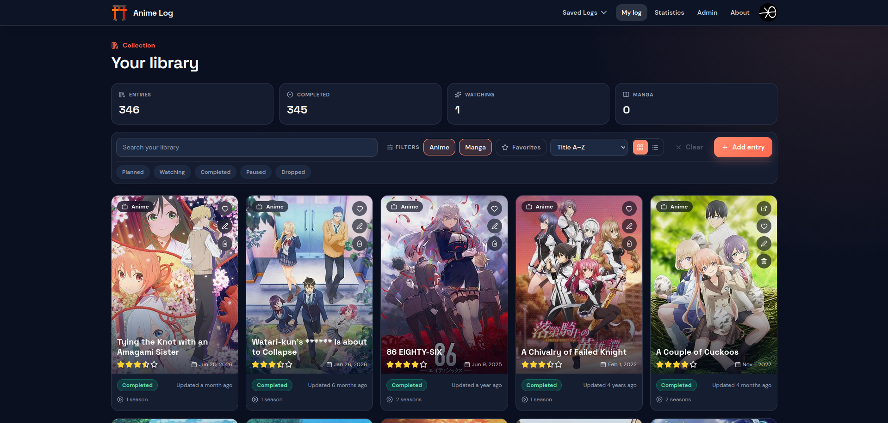
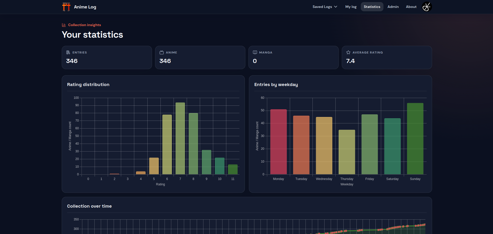

[](https://github.com/WieseChristoph/anime-log/blob/main/LICENSE)


# Anime Log

Website to log and share watched anime.

## Home



## Stats



# Configuration

## Next-Auth Data

Set environment variables:

```
NEXTAUTH_SECRET=<use [openssl rand -hex 32] to generate a 32 bytes value>
NEXTAUTH_URL=<http://YOUR_DOMAIN> (must not be set when deploying to vercel)
NEXT_PUBLIC_SITE_URL=<https://YOUR_DOMAIN> (used for canonical and social metadata)
```

## Discord Authentication

Set environment variables:

```
DISCORD_CLIENT_ID=<YOUR_CLIENT_ID>
DISCORD_CLIENT_SECRET=<YOUR_CLIENT_SECRET>
DISCORD_BOT_TOKEN=<YOUR_BOT_TOKEN>
```

## Database Connection

Set environment variable `DATABASE_URL` with an [CockroachDB](https://www.cockroachlabs.com/) database URL. Alternatively you can use a Postgres database URL, but you need to change the datasource provider in `prisma/schema.prisma` from `cockroach` to `postgresql`.

# Developement Run

```bash
# install dependencies
pnpm install
# run project
pnpm run dev
```

The server will listen on `localhost:3000`.

# Production Build

```bash
# install dependencies
pnpm install
# build project
pnpm run build
# run project
pnpm run start
```

The server will listen on `localhost:3000`.

# Docker production

- Copy `docker-compose.yml.example` to `docker-compose.yml`
- Create a local `.env` file with the required values; do not commit it
- Set `DATABASE_URL` to use the Compose hostname `db`, for example `postgresql://anime_log:<password>@db:5432/anime_log`
- Set `POSTGRES_PASSWORD` in `.env`; the Compose file uses it to initialize the database and requires it to be non-empty.
- Set `NEXT_PUBLIC_SITE_URL` to the public HTTPS origin; Compose passes it into the Next.js build so canonical and social metadata use the correct host.
- Run `docker compose up -d --build`; migrations run as a separate one-shot service before the web service starts
- The server will listen on `localhost:80`

# Releases

Push a new version tag to a commit to create a GitHub release and build and publish the Docker image:

```bash
git tag v1.2.3
git push origin v1.2.3
```

The image is available at `ghcr.io/wiesechristoph/anime-log`.
